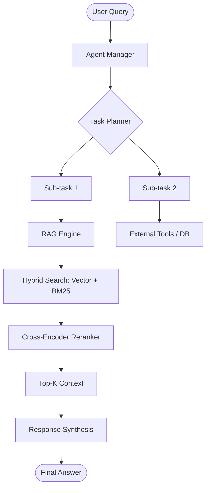

# Advanced Agentic RAG Framework

[](https://opensource.org/licenses/MIT)
[](https://www.python.org/downloads/)
[](https://github.com/langchain-ai/langchain)
[](https://github.com/run-llama/llama_index)

## 🚀 Overview

The **Advanced Agentic RAG Framework** is a research-grade system designed for production-level Retrieval-Augmented Generation (RAG). It integrates multi-step reasoning agents with advanced retrieval strategies, including hybrid search (semantic + keyword), reranking, and dynamic tool orchestration.

This repository serves as a blueprint for Senior Applied Scientists and AI Architects building complex, autonomous knowledge retrieval systems.

## 🏗️ Architecture

The framework is built on three core pillars:

1.  **Agentic Orchestration**: Uses a reasoning loop (ReAct/Plan-and-Solve) to decompose complex queries into sub-tasks.
2.  **Advanced RAG Engine**: Implements semantic search with reranking and hybrid retrieval to maximize precision and recall.
3.  **Modular Infrastructure**: Scalable vector database configurations and extensible tool abstractions.

### Technical Diagram (Conceptual)



## 🛠️ Key Features

-   **Multi-Step Reasoning**: Agents can call the RAG engine multiple times to gather fragmented information.
-   **Hybrid Retrieval**: Combines Dense (Embeddings) and Sparse (BM25) retrieval for robust search.
-   **Reranking**: Integrates state-of-the-art rerankers to improve context relevance.
-   **Extensible Tooling**: Easily add new tools for API calls, database lookups, or web searches.
-   **Type-Safe Implementation**: Full type hinting for better developer experience and reliability.

## 📂 Repository Structure

```text
.
├── core/
│   ├── agents/
│   │   └── agent_manager.py     # Agent orchestration and ReAct logic
│   └── rag/
│       └── rag_engine.py       # Hybrid retrieval and reranking logic
├── infrastructure/
│   └── vector_db_setup.py      # Vector DB (Chroma/FAISS) initialization
├── requirements.txt            # Project dependencies
└── README.md                   # Documentation
```

## 🚦 Getting Started

### Prerequisites

- Python 3.9 or higher
- OpenAI API Key

### Installation

1.  **Clone the repository**:
    ```bash
    git clone https://github.com/your-org/Advanced-Agentic-RAG-Framework.git
    cd Advanced-Agentic-RAG-Framework
    ```

2.  **Install dependencies**:
    ```bash
    pip install -r requirements.txt
    ```

3.  **Configure environment**:
    Create a `.env` file in the root directory:
    ```env
    OPENAI_API_KEY=your_api_key_here
    VECTOR_DB_PATH=./data/chroma_db
    ```

## 🧪 Usage

```python
from core.agents.agent_manager import AgentManager

# Initialize the agentic framework
agent = AgentManager()

# Run a complex query
query = "Compare the quarterly earnings of Company A and Company B, and summarize their growth risks."
response = agent.run(query)

print(response)
```

## 📜 License

Distributed under the MIT License. See `LICENSE` for more information.

## 📧 Contact

**AI Architect / Project Lead** - [your-email@example.com]
